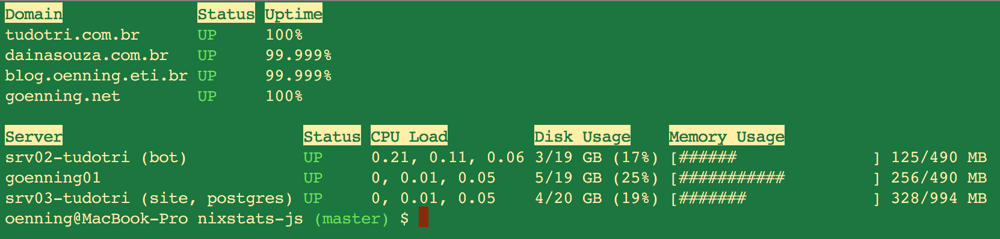

# NIXStats.js is CLI and JavaScript Wrapper for [NIXStats](https://nixstats.com)

## Using as CLI

### Install

Install it with `npm install -g nixstats`.

### Usage

Go to [NIXStats](https://nixstats.com) and generate your own API token.

Run `nixstats config <your_token_goes_here>`

Run `nixstats now` to see current servers situation.



### Help

Run `nixstats --help` for full CLI options.

## Using as a JavaScript Wrapper for NIXStats API

### Install

Install it with `npm install nixstats -save`.

### Usage

```javascript
var ns = require('nixstats');
var nsClient = new ns.NIXStatsClient('<<your_token_goes_here>');
nsClient.server.list().then((result) => {
  for(var server of result.servers) {
    //...
  }
});
```

### About

1. For full list of `NIXStatsClient` functions see [index.js](lib/index.js);
2. All functions are returned as Promises;
3. The result of each Promise is exactly as shown in the [official documentation](https://nixstats.com/api/documentation.html);

## Looking forward

- [CLI] output more useful information;
- [CLI] more operations, history, details, etc;
- [Wrapper] enable the user to choose between Promises or Callback;